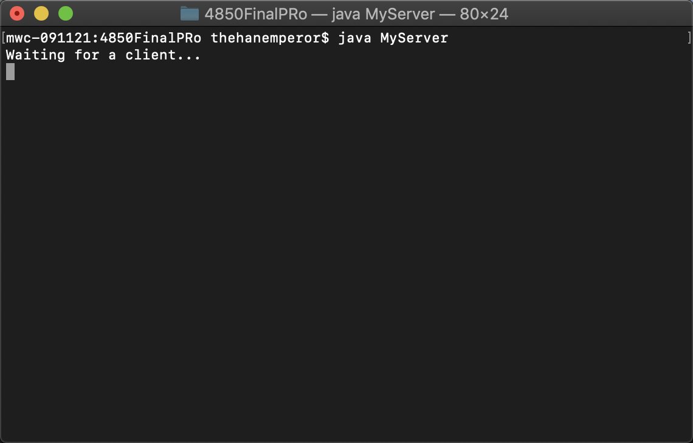
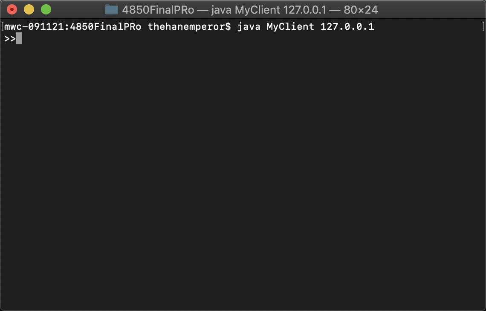
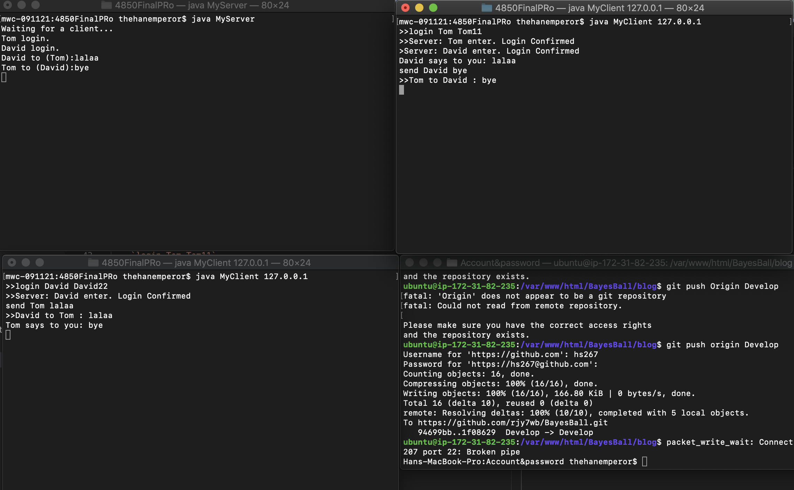

# Chat room Tutorial. (using Java)

Author: WS
Date: 2018/11/19

## 1. compile Sever & Compile client

* `javac MyServer.java `

  `javac MyClient.java`

## 2. Run both code
 *   `java MyServer`

 

*    `java MyClient 127.0.0.1`

     `// the 127.0.0.1 is the local address`

## 3. login as the client
* all the user info are defined in lab3.txt

    ( Tom Tom11

    David David22

    Beth Beth33

    John John44 ) -----> lab3.txt

    `login Tom Tom11`

    `login David David22`

## 4. send message to clients

* If you are Tom and you want to text David

    `send David hello`

    Inversely, send Tom from David

    `send Tom Hi`

    * All of the logs will be displayed on MyServer, and the following is the image of the result

**HORRAY!!!! You are Done with this LAB**
